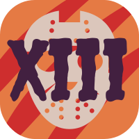

# **Team name**
  *The JSONs*

# **Team brand**

# **Roster of team members**
- Guillaume Cristiani - *Team Lead* (guillaume.crist@gmail.com)
  >Link to personal webpage: https://trioud.github.io/

- Nick Ehsani - *Team Lead* (niehsani@ucsd.edu)
  >Link to personal webpage: https://nickehsani.github.io/CSE110GithubPages/

- Matthew Bernard - *Planner* (mibernar@ucsd.edu)
  >Link to personal webpage: https://mibernard.github.io/GitHub-Pages-CSE110/

- Zachary Weber - *Designer* (zgweber@ucsd.edu)
  >Link to personal webpage: https://zweber01.github.io/CSE110Lab1/

- Brendan Devlin - *Developer* (bdevlin@ucsd.edu)
  >Link to personal webpage: https://donttestturing.github.io/

- Kenny Nguyen - *Developer* (kcnguyen@ucsd.edu)
  >Link to personal webpage: https://kennyn-ucsd.github.io/lab0-1/

- Amaan Singh - *Developer* (amsingh@ucsd.edu)
  >Link to personal webpage: https://amaansingh160.github.io/pages-project/

- Ada Burton - *Developer* (aburton@ucsd.edu)
  >Link to personal webpage: https://adaburton.github.io/
  
- Dou Hoon Kwark - *Developer* (dkwark@ucsd.edu)
  >Link to personal webpage: https://douhoonkwark.github.io/CSE110/ 

   

# Any values that we think are important
- Respect and Empathy
- Inclusion
- Aesthetics
- Dependability
- Punctuality
- Quick responses to communication 
- That the team enhances and streamlines the processes
- Understanding the impact and meaning of our work
- User privacy
- Quality software with extensive documentation

# Humor & Culture
We all enjoy Anime. We are all big fans of Halloween, hence the team name. 